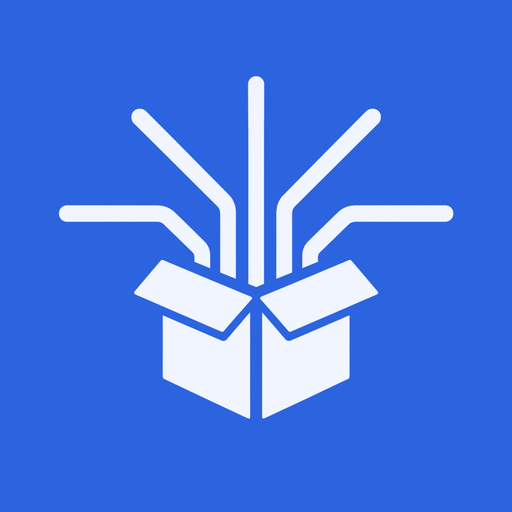

<div align="center">



# bansos-router

Free, keyless coding models for every coding harness, through one local
daemon. Works without accounts or API keys.

</div>

## Quick start

```bash
npm i -g bansos-router
```

Start the daemon and point your coding harness at it:

```bash
bansos start --bg       # detached daemon on 127.0.0.1:17070
bansos setup opencode   # configure any supported harness
```

For **[pi](https://github.com/earendil-works/pi)**, install the companion extension ([`extensions/pi`](extensions/pi/README.md)):

```bash
pi install npm:pi-bansos-router
```

Supported harnesses for `bansos setup`: `claude-code`, `aider`, `opencode`, `codex`, `hermes`, `goose`, `openclaw`, `antigravity`, `jcode`, `9router`, `continue`, `cline`, and `roo`. See [docs/harnesses.md](docs/harnesses.md) for harness-specific details.

Open `http://127.0.0.1:17070` in your browser for the Web UI dashboard (model catalog, live latency ping, 1-click config generator, relay manager, playground).

## Docker

Run the daemon in a container instead of installing globally:

```bash
docker build -t bansos-router .
docker run -d --name bansos -p 17070:17070 -v bansos-data:/root/.bansos bansos-router
```

Or with compose:

```bash
docker compose up -d
```

- Image is a multi-stage build on node:22-alpine (~58 MB compressed), CLI +
  daemon + Web UI included, zero runtime dependencies.
- The container runs the daemon in the foreground (Docker owns the lifecycle)
  bound to `0.0.0.0`, with tini for correct signal forwarding and a healthcheck
  on `/healthz`.
- State persists across restarts in the `bansos-data` volume; point your
  harnesses at `http://127.0.0.1:17070` as usual.
- `docker compose logs -f` replaces `bansos logs` inside the container.

## CLI reference

| Command | Purpose |
|---|---|
| `bansos start [--bg] [--port N] [--bind H] [--unsafe-allow-non-loopback]` | Run the daemon (foreground, or detached with `--bg`) |
| `bansos logs [--activity]` | Tail the daemon log in real time (every mode — daemon always logs to `~/.bansos/logs/bansosd.log`); `--activity` prints the structured request feed shown in the web UI "Activity" tab |
| `bansos stop` | Stop all running daemons |
| `bansos status [--json]` | Daemon status (port, model count, alive models); reports every running daemon on the auto-bump range (17070-17090) |
| `bansos models [--json]` | List live catalog from `/v1/models` |
| `bansos ping [model] [--json]` | Probe live latency and rate-limit status of all models (or a specific model) |
| `bansos refresh` | Ask the daemon to re-run health checks now |
| `bansos setup <harness...> [--model <id>] [--dry-run] [--undo]` | Write, update, or undo harness configs |
| `bansos relay <on\|off\|status\|url\|use\|list\|remove>` | Manage relay egress |
| `bansos doctor` | Diagnose daemon reachability and harness config validity |
| `bansos --version` | Print version |
| `bansos <command> --help` / `bansos help <command>` | Per-command usage, defaults, exit codes, examples |
| `bansosd` | Alias for the daemon (e.g. `bansosd --bg`) |

## Strict security mode

Strict mode is opt-in and fail-closed. Add a `security` block to
`~/.bansos/config.json` and explicitly list every provider that may receive
requests:

```json
{
  "port": 17070,
  "bind": "127.0.0.1",
  "security": {
    "mode": "strict",
    "allowedUpstreams": ["zen"],
    "allowCrossProviderFailover": false
  }
}
```

With `mode: "strict"`:

- Non-loopback binds rejected unless `--unsafe-allow-non-loopback` passed.
- Relay egress, probing, and mutation disabled across CLI, API, Web UI.
- Only exact upstreams in `allowedUpstreams` receive requests (empty list blocks all).
- Cross-provider failover disabled.
- API keys, PATs, private keys, and credentials blocked with HTTP 422 before egress.
- Sensitive values and raw upstream errors suppressed from logs.

## What it does

- One local daemon on `127.0.0.1:17070`, started with `bansos start`. It speaks
  three wire protocols: OpenAI Chat Completions, Anthropic Messages, and OpenAI
  Responses (Codex CLI).
- Keyless free upstreams only: OpenCode Zen, KiloCode gateway, and LLM7.
- `bansos setup <harness>` writes config for Claude Code, Aider, OpenCode,
  Codex, Hermes, Goose, OpenClaw, Antigravity, JCode, 9Router, Continue, Cline, and Roo Code.
- Web UI dashboard served at `http://127.0.0.1:17070/` with model catalog explorer,
  live ping probes, 1-click harness setup generator, relay egress manager, and test playground.
  The catalog shows per-model capabilities (Think / Vision badges) and a live
  usage + activity tracker (requests, tokens, latency, error rate).
- The pi extension ([`pi-bansos-router`](extensions/pi/README.md)) registers the
  `bansosr` provider, so every free model shows up in pi's `/model` picker. There is
  also a `/bansosr` command for status. If the daemon is not running when pi
  starts, the extension starts it and stops it again on exit.
- The catalog is health-checked: live `:free` models replace stale seeds on a
  timer. Relay egress can route around rate limits, and there is a per-IP rate limiter.
- If a model is rejected with `429`/`5xx`, the daemon auto-fails over to the
  closest equivalent model on a different upstream (same reasoning level,
  context window, and effort capability), retrying up to two extra candidates
  before surfacing an error. Request duration (`durationMs`) is logged on every
  completion and rejection.

## Available models

By default, `bansos setup` automatically configures intelligent defaults per harness:
- **Claude Code**: Maps tiers automatically (`haiku` → fast non-reasoning, `sonnet` → daily reasoning, `opus` → highest-capacity reasoning).
- **Multi-model harnesses** (`opencode`, `goose`, `openclaw`, `continue`, `9router`, `jcode`): Registers all available models (or dynamic `/v1/models` provider) with `tencent/hy3:free` as primary default.
- **Single-model harnesses** (`aider`, `codex`, `hermes`, `antigravity`, `cline`, `roo`): Defaults to `tencent/hy3:free`. Pass `--model <id>` to pin a specific model. Context and max output
are token counts. The live catalog is ~33 models and changes as upstreams rotate
free tiers; run `bansos models` or `bansos ping` to see what is alive right now.

### OpenCode Zen

| model id | reasoning | vision | context | max output |
|---|---|---|---|---|
| `mimo-v2.5-free` | ❌ | ✓ | 1M | 131k |
| `nemotron-3-ultra-free` | ✓ | ❌ | 1M | 65k |
| `big-pickle` | ✓ | ❌ | 200k | 32k |
| `laguna-s-2.1-free` | ✓ | ❌ | 262k | 32k |
| `hy3-free` | ✓ | ❌ | 256k | 65k |
| `nemotron-3.5-lightning-free` | ✓ | ❌ | 1M | 65k |
| `muse-spark-1.2-contributor-free` | ❌ | ❌ | 1M | 65k |

### KiloCode gateway

| model id | reasoning | vision | context | max output |
|---|---|---|---|---|
| `kilo-auto/free` | ❌ | ❌ | 256k | 10k |
| `stepfun/step-3.7-flash:free` | ❌ | ✓ | 262k | 262k |
| `tencent/hy3:free` | ✓ | ❌ | 262k | 128k |
| `poolside/laguna-s-2.1:free` | ✓ | ❌ | 262k | 32k |
| `dots-studio/dots-3-note-preview:free` | ❌ | ✓ | 512k | 10k |
| `liquid/lfm-2.5-2.6b:free` | ❌ | ❌ | 128k | 8k |
| `nvidia/nemotron-3.5-lightning:free` | ✓ | ❌ | 1M | 65k |
| `thinkingmachines/inkling-small:free` | ❌ | ✓ | 1M | 10k |
| `thinkingmachines/inkling:free` | ❌ | ✓ | 1M | 10k |
| `poolside/laguna-xs-2.1:free` | ❌ | ❌ | 262k | 32k |
| `cohere/north-mini-code:free` | ❌ | ❌ | 256k | 64k |
| `nvidia/nemotron-3.5-content-safety:free` | ✓ | ✓ | 128k | 8k |
| `nvidia/nemotron-3-ultra-550b-a55b:free` | ✓ | ❌ | 1M | 65k |
| `minimax/minimax-m3:free` | ❌ | ✓ | 1M | 10k |
| `nvidia/nemotron-3-nano-omni-30b-a3b-reasoning:free` | ✓ | ✓ | 256k | 65k |
| `minimax/minimax-m2.7:free` | ❌ | ❌ | 196k | 10k |
| `nvidia/nemotron-3-super-120b-a12b:free` | ✓ | ❌ | 262k | 262k |
| `openrouter/free` | ❌ | ✓ | 200k | 65k |

### LLM7

| model id | reasoning | vision | context | max output |
|---|---|---|---|---|
| `codestral-latest` | ❌ | ❌ | 32k | 8k |
| `deepseek-v3.2` | ✓ | ❌ | 128k | 16k |
| `gemini-3.1-flash-lite` | ❌ | ❌ | 256k | 65k |
| `gpt-oss` | ✓ | ❌ | 131k | 16k |
| `meta-Llama-3.1-8B-Instruct-Turbo` | ❌ | ❌ | 128k | 16k |
| `minimax-m2.7` | ✓ | ❌ | 180k | 32k |
| `mistral-Nemo-Instruct-2407` | ❌ | ❌ | 128k | 16k |
| `default` | ❌ | ❌ | 128k | 8k |
| `fast` | ❌ | ❌ | 128k | 8k |

Notes:

- The tables above are generated from a live `/v1/models` snapshot, not the
  static seed. The seeded defaults (in `src/upstreams/*`) are used only until
  the daemon's first successful refresh; the live catalog replaces them.
- Kilo's `:free` models are liveness-gated: the daemon re-checks the kilo
  catalog on a timer and drops models that are no longer offered free.
- Zen's `/v1/models` lists *claude-\** ids that differ from the free coding
  models above, so the zen set is pinned to the seeded list.
- LLM7 models are filtered dynamically by `usage_based_only: false` (tier turbo);
  `default` and `fast` are stable selectors. `pro` tier is paid-only and excluded.

## Development

For contributors working from source:

```bash
git clone https://github.com/ihsan-ramadhan/bansos-router
cd bansos-router
npm install
npm run build      # builds Web UI (Vite) + CLI (esbuild), outputs dist/
npm link           # make `bansos`/`bansosd` available globally
npm run typecheck  # tsc --noEmit
npm test           # node:test

npm run dev        # run the bansos CLI from source
npm run dev:daemon # run the daemon from source
npm run dev:ui     # run Vite dev server for Web UI
```

## Docs

- [Architecture](docs/architecture.md)
- [Wire protocols & translation](docs/protocols.md)
- [Harness integration](docs/harnesses.md)
- [Upstreams, catalog & relay](docs/upstreams.md)
- [Contributing](CONTRIBUTING.md)

## License

MIT
